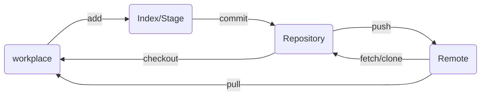
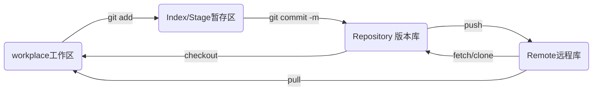
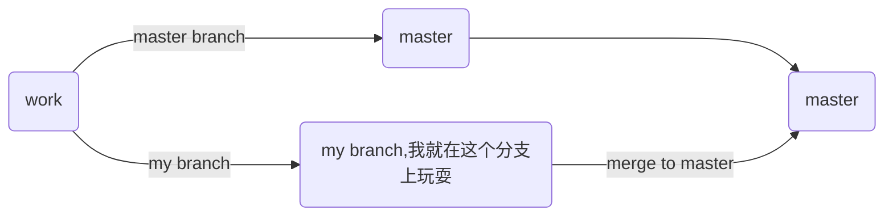

# Git使用技巧

# 1. Git简介

* Git是一种分布式版本管理系统，每个人的电脑就是一个完整的版本库。
* 相对于集中式的版本管理系统，Git的强大在于免费、效率和分支管理能力。

> 集中式和分布式的区别是：
> 你的本地是否有完整的版本库历史！
>
> * 假设SVN服务器没了，那你丢掉了所有历史信息，因为你的本地只有当前版本以及部分历史信息。
> * 假设GitHub服务器没了，你不会丢掉任何git历史信息，因为你的本地有完整的版本库信息。你可以把本地的git库重新上传到另外的git服务商。

# 2. Git的安装

## 2.1 在Linux上安装Git

* Debian或Ubuntu Linux，通过一条`sudo apt-get install git`就可以直接完成Git的安装
* 老一点的Debian或Ubuntu Linux，要把命令改为`sudo apt-get install git-core`
* 其他Linux版本，可以直接通过源码安装。先从Git官网下载源码，然后解压，依次输入：`./config`，`make`，`sudo make install`这几个命令安装就好了

## 2.2 在Mac OS X上安装Git

* homebrew安装
* XCode安装

## 2.3 在Windows上安装Git

* 在Windows上使用Git，可以从Git官网直接[下载安装程序](https://git-scm.com/downloads)

* 使用$Git \rightarrow Bash$来运行窗口程序

  

# 3. Git的一些配置配置

## 3.1 初始化配置

* 安装完成后，用以下的代码对Git进行初始化配置：Git是分布式版本管理系统，需要填写用户名和邮箱，相当于为这台机器的Git配置一个标识。

```shell
$Git config --global user.name "Your Name"
$Git config --global user.email "Your Email:email@example.com"
```

> 注意`git config`命令的`--global`参数，用了这个参数，表示你这台机器上所有的Git仓库都会使用这个配置，当然也可以对某个仓库指定不同的用户名和Email地址


# 4 Git的使用技巧

## 4.1 Git基本使用流程示意



<center>Git基本使用流程示意图及关键操作过程</center>

* Workplace：工作区
* Index/Stage：暂存区
* Repository：仓库区（**或本地仓库**）
* Remote：远程仓库

## 4.2 创建版本库（Repository）

### 4.2.1 创建空白版本库

* **版本库又名仓库，英文名repository，**可以简单的理解一个目录，这个目录里面的所有文件都可以被Git管理起来，每个文件的修改，删除，Git都能跟踪，以便任何时刻都可以追踪历史，或者在将来某个时刻还可以将文件“还原”。

* 版本库的创建/初始化：```git init```

```shell
$ cd working_directory #进入要创建仓库的根目录
$ mkdir gitlearn #创建文件夹，这个文件夹gitlearn就是Repository
$ cd gitlearn #进入文件夹
$ git init #初始化仓库
Initialized empty Git repository in /Users/working_directory/learngit/.git/
```

* 当前目录（Repository）下多了一个`.git`的目录，这个目录是Git来跟踪管理版本库的，没事千万不要手动修改这个目录里面的文件

### 4.2.2 从已有文件夹中创建版本库

* 也不一定必须在空目录下创建Git仓库，选择一个已经有东西的目录也是可以的。


## 4.3 往Repository中添加文件

* 所有的版本管理系统，**只能跟踪文本文件的改动，比如TXT、网页和所有的程序代码**。对于，图片、视频、office文件等这些二进制文件，虽然也能由版本控制系统管理，但没法跟踪文件的变化，只能把二进制文件每次改动串起来，也就是只知道图片从100KB改成了120KB，但到底改了啥，版本控制系统不知道，也没法知道。

* **往版本库里面添加文件：**

  * 要添加的文件一定要放在Git的Repository文件夹当中；

  * 使用`git add`命令将文件加载到暂存区（Index/Stage）

  * 采用`git commit -m`命令将文件提交到版本库当中（Repository）；

  * 采用`git status`命令查看是否还有文件未提交

  * **在提交给仓库之前**，可以采用`git diff`命令来查看文件的修改

    

```shell
$ vim readmem.txt #编辑一个二文件，
# 文件内容：
# Git is a version control system
# Git is a free software
$ git add readme.txt #将文件添加到暂存区
$ git commit readme.txt文件新建提交" #-m 参数后面任意内容，当然最好是有意义的，这样你就能从历史记录里方便地找到改动记录。
$ vim readme.txt #修改readme.txt文件，添加一行新内容
$ git staus #查看当前的状态，提示有文件没有提交
$ git add readme.txt
$ git commit -m 'new amend the file'
```

* `git add`可以一次添加多次文件，中间用空格分开。
* `git commit -m`一次提交多次文件

* `git add`的一些参数说明：

```shell
git add
    -n, --dry-run         dry run
    -v, --verbose         be verbose

    -i, --interactive     interactive picking
    -p, --patch           select hunks interactively
    -e, --edit            edit current diff and apply
    -f, --force           allow adding otherwise ignored files
    -u, --update          update tracked files
    --renormalize         renormalize EOL of tracked files (implies -u)
    -N, --intent-to-add   record only the fact that the path will be added later
    -A, --all             add changes from all tracked and untracked files
    --ignore-removal      ignore paths removed in the working tree (same as --no-all)
    --refresh             don't add, only refresh the index
    --ignore-errors       just skip files which cannot be added because of errors
    --ignore-missing      check if - even missing - files are ignored in dry run
    --sparse              allow updating entries outside of the sparse-checkout cone
    --chmod (+|-)x        override the executable bit of the listed files
    --pathspec-from-file <file>
                          read pathspec from file
    --pathspec-file-nul   with --pathspec-from-file, pathspec elements are separated with NUL character
```


## 4.4 版本回退

* `git status`让我们时刻掌握仓库当前的状态；**在提交给repository之前进行查看**
* `git diff`查看文件修改过的内容，**在提交给repository之前进行查看**
* `git log`查看历史的修改记录，**显示从最近到最远的显示日志**，Git显示的版本号是经过SHA就算出来的一个非常大的数，用十六进制表示。

```shell
$ git log                                                         
commit 277293a635c354130589200310b263ce3f873980 (HEAD -> master)
Author: zhanghaohong <327471445@qq.com>
Date:   Fri Feb 3 21:25:53 2023 +0800

    delete line

commit 1d383423d2d94b0085bf5bfb756e79d722f97ce6
Author: zhanghaohong <327471445@qq.com>
Date:   Fri Feb 3 20:18:12 2023 +0800

    changge

commit 9ac7d1b4305aedfe921032e9c8524419495d1ae8
Author: zhanghaohong <327471445@qq.com>
Date:   Fri Feb 3 20:15:11 2023 +0800

    new

commit 6f0c9a0d31a1d22874792167d9ed788435f56ac6
Author: zhanghaohong <327471445@qq.com>
Date:   Fri Feb 3 20:12:05 2023 +0800

    add line 4

commit ed41f4f887d16107d41176aee26638cbaaff6fe0
Author: zhanghaohong <327471445@qq.com>
Date:   Fri Feb 3 20:08:04 2023 +0800

    add new line

commit 6ac89b829dd4e4ca2dcd2f650b548bbf4a7428c1
Author: zhanghaohong <327471445@qq.com>
Date:   Fri Feb 3 20:06:56 2023 +0800

    创建readme.txt
```

* **版本回退操作：**
  * 首先，Git必须知道当前的版本号。从`git log`中输入的结果，第一个`HEAD`表示的就是最新版本，而`HEAD^`则表示上一个版本，``HEAD^^``表示上上一个版本，当然往上100个版本写100个`^`比较容易数不过来，所以写成`HEAD~100`。
  * 使用`git reset --hard HEAD^`回退到上一个版本。
  * 但这个时候，之前的最新的版本信息会没有了。如果窗口没有被关掉，你可以找会原来`git log`里面的一些版本号值，通过`git reset --hard 版本号`来进行版本的跳转。
  * Git的版本回退速度非常快，因为Git在内部有个指向当前版本的`HEAD`指针，当你回退版本的时候，Git仅仅是把HEAD从指向你想要回退到的位置上而已。
  * **Git提供了一个命令`git reflog`用来记录你的每一次命令**，这样不管什么时候，你都可以跳转到你想要的版本当中。

```ascii
┌────┐
│HEAD│
└────┘
   │
   └──▶ ○ append GPL
        │
        ○ add distributed
        │
        ○ wrote a readme file
```

```ascii
┌────┐
│HEAD│
└────┘
   │
   │    ○ append GPL
   │    │
   └──▶ ○ add distributed
        │
        ○ wrote a readme file
```


## 4.5 工作区、暂存区和分支master

* `.git`目录称为Git的版本库，里面存了很多东西：
  * 其中最重要的就是称为stage（或者叫index）的暂存区，还有Git为我们自动创建的第一个分支`master`，以及指向`master`的一个指针叫`HEAD`
* 当我们把文件王Git版本库里添加的时候，是分两步执行的：
  * 第一步：用`git add`把文件添加进去，实际上就是把文件修改添加到暂存区
  * 第二步：用`git commit`提交更改，实际上就是把暂存区的所有内容提交到当前分支。因为我们创建Git版本库时，Git自动为我们创建了唯一一个`master`分支，所以，现在，`git commit`就是往`master`分支上提交更改。（可以不一定在master分支，甚至可以添加属于指定人的分支）。**需要提交的文件修改通通放到暂存区，然后，一次性提交暂存区的所有修改。**



* `git commit`只会提交在**暂存区的修改**，在工作区在没有被`add`到暂存区之前是不会被`commit`提交到版本库当中的。
* 用`git diff HEAD -- file_name`命令可以查看工作区和版本库里面最新版本的区别。
* `git status`对比工作区和版本库之间的差异


## 4.6 文件删除

* 当你删除文件时，`git status`显示有文件被删除（工作区和版本库不一致），这个时候:
  * 如果你真要删除文件，那么通过`git rm`对版本库中的文件进行删除，并且`git commit`。你只能恢复文件到最新版本，你会丢失**最近一次提交后你修改的内容**。
  * 删错了，因为版本库里还有呢，所以可以很轻松地把误删的文件恢复到最新版本：`git checkout -- test.txt`，其中test.txt代表要恢复的文件。


> 新版本 git version 2.35.1.windows.2
>
> 对于文件删除操作使用`git restore --staged <deleted file>`
>
> 来丢弃暂存区该次删除操作, 在`git checkout -- <delete file>`


# 5 远程仓库操作（Remote Repository）

* 远程仓库就是运行一个远程仓库服务器的Git服务器。
* [GitHub](github.conm):提供Git仓库托管服务的，所以，只要注册一个GitHub账号，就可以免费获得Git远程仓库。

## 5.1 GitHub创建远程仓库连接SSH

* 创建SSH Key：用以与GitHub之间的SSH加密通信：

```shell
$ ssh-keygen -t rsa -c "Youremail@email.com"
```

* 如果一切顺利的话，可以在用户主目录里找到`.ssh`目录，里面有`id_rsa`和`id_rsa.pub`两个文件，这两个就是SSH Key的秘钥对，`id_rsa`是私钥，不能泄露出去，`id_rsa.pub`是公钥，可以放心地告诉任何人。

> Windows的RSA文件路径是：/c/Users/Administrator/.ssh/id_rsa

* 登陆GitHub，打开“Account settings”，“SSH Keys”页面：点“Add SSH Key”，填上任意Title，在Key文本框里粘贴`id_rsa.pub`文件的内容。
* 在GitHub上免费托管的Git仓库，任何人都可以看到喔（但只有你自己才能改）。所以，不要把敏感信息放进去。
* 如果你不想让别人看到Git库，有两个办法，一个是交点保护费，让GitHub把公开的仓库变成私有的，这样别人就看不见了（不可读更不可写）。另一个办法是自己动手，**搭一个Git服务器**，因为是你自己的Git服务器，所以别人也是看不见的。

## 5.2 添加远程仓库

* 登陆GitHub，然后，在右上角找到“Create a new repo”按钮，创建一个新的仓库
* GitHub告诉我们，可以从这个仓库克隆出新的仓库，也可以把一个已有的本地仓库与之关联，然后，把本地仓库的内容推送到GitHub仓库。

```shell
$ git remote add origin git@github.com:dgzhanghaohong/gitlearn.git
# 我在远程创建了gitlearn这个repository，github账号是：dgzhanghaohong
# 远程库的名字就是origin，这是Git默认的叫法，也可以改成别的，但是origin这个名字一看就知道是远程库
```

* 现在可以将本地仓库的内容推送到远程仓库，采用的命令是：`git push`

```shell
$ $ git push -u origin master
# 用git push命令，实际上是把当前分支master推送到远程
# 由于远程库是空的，我们第一次推送master分支时，加上了-u参数，Git不但会把本地的master分支内容推送的远程新的master分支，还会把本地的master分支和远程的master分支关联起来，在以后的推送或者拉取时就可以简化命令。
# 只要本地作了提交，就可以通过命令
$ git push origin master
```


## 5.3 删除远程库

* 如果添加的时候地址写错了，或者就是想删除远程库，可以用`git remote rm <name>`命令
* 使用前，建议先用`git remote -v`查看远程库信息

```shell
$ git remote -v
origin  git@github.com:dgzhanghaohong/gitlearn.git (fetch)
origin  git@github.com:dgzhanghaohong/gitlearn.git (push)

$ git remote rm origin
# 根据名字删除，比如删除origin
# 此处的“删除”其实是解除了本地和远程的绑定关系，并不是物理上删除了远程库。远程库本身并没有任何改动。要真正删除远程库，需要登录到GitHub，在后台页面找到删除按钮再删除。
```


```shell
# Summary：
git remote add origin git@server-name:path/repo-name.git #关联一个远程库
# 关联一个远程库时必须给远程库指定一个名字，origin是默认习惯命名
# 关联后，使用命令
git push -u origin master # 第一次推送master分支的所有内容

```


## 5.4 从远程库中克隆（Clone）

* 假设我们从零开发，那么最好的方式是先创建远程库，然后，从远程库克隆。
* 远程库已经准备好了，下一步是用命令`git clone`克隆一个本地库。

```shell
git@github.com:dgzhanghaohong/learngit.git
```

* GitHub给出的地址不止一个，还可以用https://github.com/dgzhanghaohong/learngit.git这样的地址。


# 6 分支管理

* 按照我的理解，分支管理就是创建出一个属于某特定组织/个人的分支，让他们可以先将过程提交到分支上，然后再合并到master上。这样，既可以不影响别人的工作，又安全。



## 6.1 创建与合并Git分支

### 6.1.1 Git创建与合并分支的原理：指针

* 每次提交，Git都把它们串成一条时间线，这条时间线就是一个分支。
* 在Git里，这个分支叫主分支，即`master`分支。
* `HEAD`严格来说不是指向提交，而是指向`master`，`master`才是指向提交的，所以，`HEAD`指向的就是当前分支。
* 每次提交，`master`分支都会向前移动一步，这样，随着你不断提交，`master`分支的线也越来越长。

```ascii
                 HEAD
                    │
                    │
                    ▼
                 master
                    │
                    │
                    ▼
┌───┐    ┌───┐    ┌───┐
│   │───▶│   │───▶│   │
└───┘    └───┘    └───┘
```


* 当我们创建新的分支，例如`dev`时，Git新建了一个指针叫`dev`，指向`master`相同的提交，再把`HEAD`指向`dev`，就表示当前分支在`dev`上

```ascii
              master
                    │
                    │
                    ▼
┌───┐    ┌───┐    ┌───┐
│   │───▶│   │───▶│   │
└───┘    └───┘    └───┘
                    ▲
                    │
                    │
                   dev
                    ▲
                    │
                    │
                  HEAD
```


* 从现在开始，对工作区的修改和提交就是针对`dev`分支了，比如新提交一次后，`dev`指针往前移动一步，而`master`指针不变：

```ascii
                 master
                    │
                    │
                    ▼
┌───┐    ┌───┐    ┌───┐    ┌───┐
│   │───▶│   │───▶│   │───▶│   │
└───┘    └───┘    └───┘    └───┘
                             ▲
                             │
                             │
                            dev
                             ▲
                             │
                             │
                           HEAD
```


* 假如我们在`dev`上的工作完成了，就可以把`dev`合并到`master`上。Git怎么合并呢？最简单的方法，就是直接把`master`指向`dev`的当前提交，就完成了合并

```ascii
                           HEAD
                             │
                             │
                             ▼
                          master
                             │
                             │
                             ▼
┌───┐    ┌───┐    ┌───┐    ┌───┐
│   │───▶│   │───▶│   │───▶│   │
└───┘    └───┘    └───┘    └───┘
                             ▲
                             │
                             │
                            dev
```

* 合并完分支后，甚至可以删除`dev`分支。删除`dev`分支就是把`dev`指针给删掉，删掉后，我们就剩下了一条`master`分支：

  ```ascii
                             HEAD
                               │
                               │
                               ▼
                            master
                               │
                               │
                               ▼
  ┌───┐    ┌───┐    ┌───┐    ┌───┐
  │   │───▶│   │───▶│   │───▶│   │
  └───┘    └───┘    └───┘    └───┘
  ```

### 6.1.2 创建分支

* 首先创建`dev`分支

```shell
git checkout -b dev
Switched to a new branch 'dev'
```

* `git checkout`命令加上`-b`参数表示创建并切换，相当于以下两条命令：

```
$ git branch dev
$ git checkout dev
Switched to branch 'dev'
```

* 用`git branch`查看当前分支 ——`git branch`命令会列出所有分支，当前分支前面会标一个`*`号。
* 你可以通过`git checkout barnch_name`来切换分支

```shell
$ git branch
* dev
  main
```

* 然后，我们就可以在`dev`分支上正常提交

```shell
$ git add readme.txt 
$ git commit -m "branch test"
[dev b17d20e] branch test
 1 file changed, 1 insertion(+)
```

* 切回main/master分支，查看新建的文件是不存在的

```shell
$ git checkout main
```

* 切换分支这个动作，用`switch`更科学。因此，最新版本的Git提供了新的`git switch`命令来切换分支

```shell
$ git switch -c dev # 创建分支
$ git switch master # 直接切换到已有的master分支
```


### 6.1.3 合并分支

```shell
$ git merge dev
Updating d46f35e..b17d20e
Fast-forward
 readme.txt | 1 +
 1 file changed, 1 insertion(+)
```

* `git merge`命令用于合并指定分支到当前分支。如果你要将`dev`分支合并到`main`分支，那么你首先需要通过`git checkout main`切换会`main`分支，然后在`main`分支内运行`git merge dev`，如此便将`dev`分支合并到当前分支`main`当中了。

  > `Fast-forward`是指本次采用的合并方式是快进方式，也就是将`master`指针直接移动到分支`dev`指针当中，这样便可快速完成两个分支的合并。Git并不是每次都能够采用`Fast-forward`方式进行合并，**还存在其它形式的合并方式**。


### 6.1.4 删除分支

合并完成后，就可以放心地删除`dev`分支了：

```shell
$ git branch -d dev
Deleted branch dev (was b17d20e).
```

> 因为创建、合并和删除分支非常快，所以Git鼓励你使用分支完成某个任务，合并后再删掉分支，这和直接在`master`分支上工作效果是一样的，但过程更安全。


## 参考资料

* 知乎专栏文章：https://zhuanlan.zhihu.com/p/135183491

* 廖雪峰的博客：https://www.liaoxuefeng.com/wiki/896043488029600

* Github官方文档：https://docs.github.com/zh/repositories

* Github账号:zhanghaohong@outlook.com;pw:Z xxx5xxx